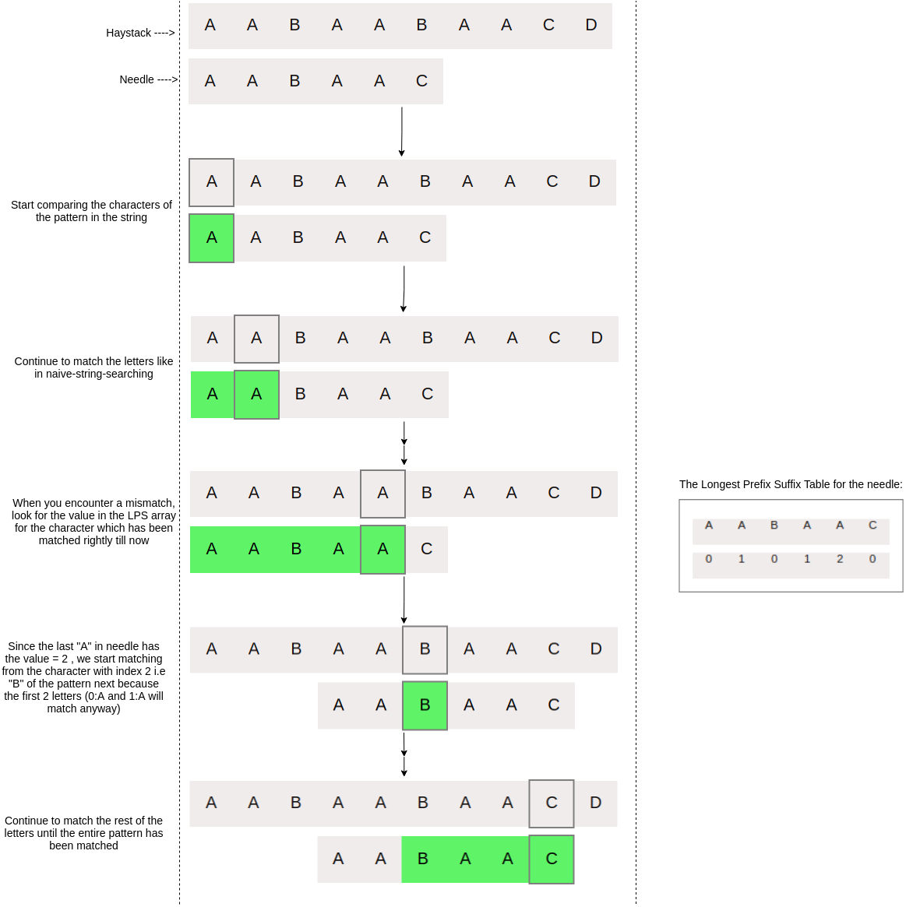

### Explanation

Unlike the bruteforce approach where we just shift the pattern by and start comparing again, we must use a value from the LPS Array to decide which character to compare next. The core idea is to avoid comparing the characters which we know will match correctly anyway.

### Algorithm
  -  We start comparing pattern (pat[patInd]) with patInd = 0
  -  We keep comparing letters pat[patInd] and string[strInd] and increment patInd and strInd as long as they match
  -  When we see a mismatch :
      -  We are aware that pat[0 to patInd-1] match correctly with string[strInd-patInd to strInd-1].
      -  From the way we had defined LPS Array, we know that LPS[patInd-1] is a count of characters of pat[0 to patInd-1] which are both prefix and suffix.
       - So, we don’t need to compare these characters as they are going to match anyway.

### Step by Step iteration example of KMP Algorithm

### Pseudocode
strInd = 0
patInd = 0
                            
while(strInd < string.length()) {  
if(pat[patInd] == string[strInd]){ 
if(patInd == pat.length()-1){  
print("Match Found at" + strInd-pat.length() )  
 return  
 }  
                                    
strInd++;  
 patInd++;  
  }  
 else {   
 if(patInd != 0){  
 patInd = LPS[patInd-1]  
}  
else {  
 strInd++;  
 }  
 }  
 }
                            

