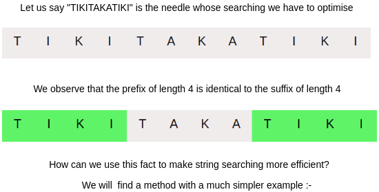

### Building Intuition

   - Let us think of a method by which we can make our bruteforce method more efficient. We notice that we have been doing redundant matching when the matching of a pattern in a string fails since we are moving the string Index back. Can we possibly track the information we get from previous comparisons?
   - We have to exploit the degenerating property of the pattern we are searching. i.e pattern having same sub-patterns appearing more than once in the pattern.

### Finding Repeating Substrings

### The Longest-Prefix-Suffix Array

The name LPS indicates the longest proper prefix which is also a suffix of the matched pattern.

Example:

AA in

AABAA is a prefix as well as a suffix.

In case AABAAC is the pattern which we are searching in some unknown string. And we happen to know that after successfully matching AABAA, C is a mismatch.

Then we can start matching the 3rd letter of pattern(B) to the letter at strInd instead of starting from the beginning.

**Definition :**
Let us define the LPS array for a pattern such that lps[i] stores the index of the pattern from where we must begin comparing if the match fails after rightly matching the pattern until that point.

