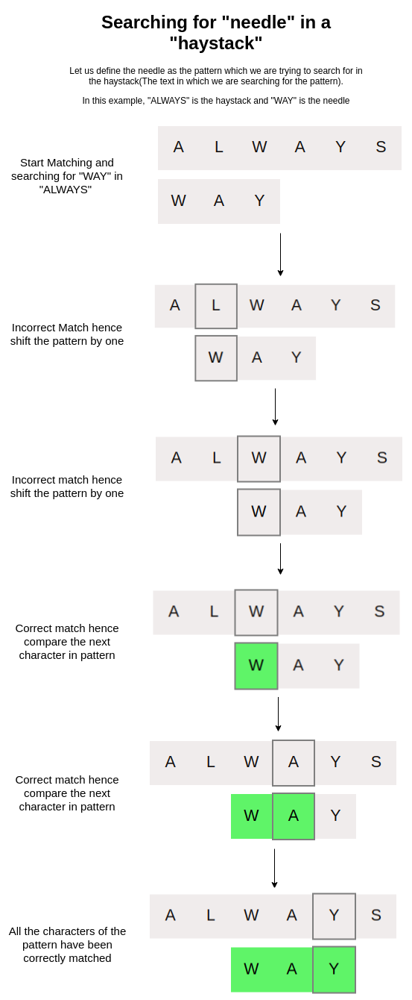

<iframe src="https://www.youtube.com/embed/3t3u0EUerLI" frameborder="0" allow="autoplay; encrypted-media" allowfullscreen></iframe>

### Why we need String Searching?

  -  Surprisingly, strings are more often used in computer science than numbers. May it be editing text documents in word processors, reading our favourite blogs or even a basic search on google.
   - Strings are everywhere. Hence it is important to study and understand the methods to manipulate, traverse and search among them.

### Real Life Applications

Efficient string searching is crucial to the way the internet functions today. They have a plethora of uses and applications:

  -  Spell Checkers
  -  Intrusion Detection systems
  -  Predictive Seach Engines
  - Plagiarism detection
  -  Information Retrieval System etc.

### Basic Approach

If we were to approach this problem of searching for a pattern inside a string, the first trivial solution would be a brute-force method. We will be examining this method in the next task of this learning unit.

### Explanation

The brute-force method to find a pattern in a given string text is:

  -  Have two pointers strInd and patInd pointing at string beginning and pattern beginning.
  -  Compare the characters present at the pointer.
  -  If they match, increase both the pointers by one.
  -  Repeat unless all the characters of pattern match or there is a mismatch
  -  If all the letters of the pattern have been matched then we have found the pattern in the string.
  -  If there is a mismatch:
      -  Bring the patInd pointer back to the beginning of the pattern
      -  Bring the strInd pointer to the second position of the string now and Repeat the process.
      -  If another mismatch is encountered , bring the strInd to the 3rd position of the string and so on.
  -  If strInd ever increases beyond the length of the string then return 0 since it means that the pattern doesn't exist in the string.

### Iteration by Iteration Visualization of Naive String Searching Algorithm 
  

### Time Complexity

Note: It is recommended to see the interactive demo task before reading this.

Deciding the big O notation for any algorithm is a function of the worst-case scenario of the algorithm. Let us consider a case - the pattern of length M to be searched in a string of length N always fails on the pattern's last character and succeeds only at the end of the string.

Example : 
**String :** AAAAAAAAAAAAAAAAAAAAAAX 
**Pattern :** AAAAAX 

Assuming that the time required to compare two characters is O(1) then the above case will take Time = O(M \times N)

Hence the naive string searching algorithm is of the complexity O(M×N)
