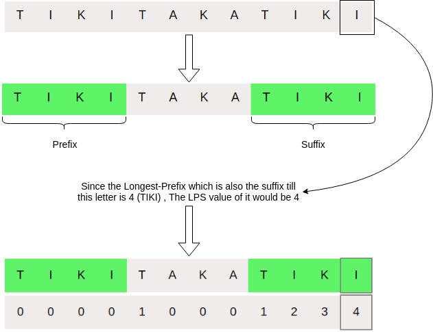

### Introduction

   - The preprocessing for the KMP algorithm involves using the pattern string to create an auxiliary array called LPS (of size same as that of the pattern) which will be used to skip character comparisons while matching to save time.
   - The name LPS indicates longest proper prefix which is also a proper suffix. LPS[i] essentially stores the length of maximum proper prefix which is also a suffix of the string LPS[0 to i] .

### Explanation and Algorithm
**How to fill LPS[i]?**

  -  We need to know the longest suffix until i that matches with prefix. The longest suffix till i-1 that matches with some prefix (say Pat[0 to j-1]) is Pat[i-j to i-1] .
  -  If the character Pat[j] matches with Pat[i] then the value of LPS[i] = LPS[i-1] + 1
  -  And if Pat[i] != Pat[j] , then the longest suffix till i might be the second longest suffix till i-1 along with the character Pat[i] and the character next to the second longest prefix of i-1 and so on.
  -  **How do we find the second longest suffix until i-1 and so on?**
      -  We know that Pat[0 to j-1] is same as Pat[i-j to i-1] and LPS[i-1] = j .
      -  Therefore, finding the second longest prefix suffix is same as finding the longest prefix suffix of Pat[0 to j-1] since this suffix of Pat[0 to i-1] would also be the suffix of Pat[0 to j-1].
      -  LPS[i] would be equal to LPS[LPS[i-1]] + 1 if Pat[i] = Pat[LPS[i-1]].
      -  This same logic can be used recursively to find LPS[i].

### Pictorial Representation of Preprocessing

### Pseudocode

function LPS_ArrayGenerator(string Pat){  
LPS = Array[Pat.length]  
                                    
j = 0  
 LPS[0] = 0  
                                    
 for(int i=1 ; i < Pat.length() ; i++){  
 while( j > 0 && Pat[i] != Pat[j] ) {  
 j = LPS[j-1]   
     }  
if(Pat[i] == Pat[j]){ j++ }  
 LPS[i] = j   
 }  
                                    
 return LPS  
 }
                            

